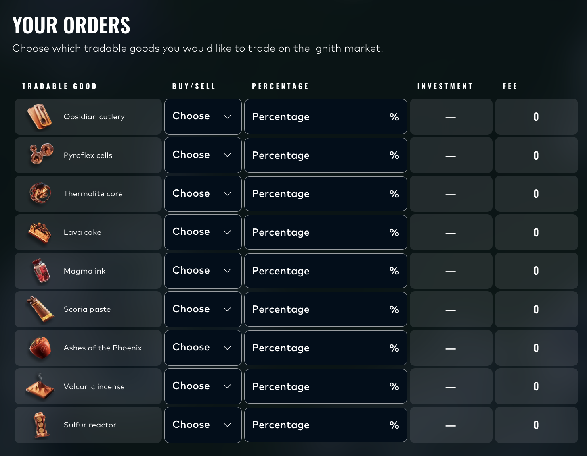

# The FTW introduced 50 new tradable goods to replace the previous ones. Fortunately, they have been categorized to provide a clear overview. Find the ones you can build a profitable strategy around and create a final Python program with them.

# Round 5 - **“The Final Stretch”**

It is the final round. You have one last opportunity to prove your worth and rise to the number one spot on the leaderboard. But this final stage will push you to the limits of your ability.

The FTW has introduced 50 new tradable goods to replace the previous ones for algorithmic trading, i.e., you can no longer trade products from previous rounds. The 50 new products are evenly distributed across 10 categories (full list below).

You must identify your winners from this extensive set of products and translate your strategy into one final Python program to generate as much profit as possible.

In addition, you will have the opportunity to trade in the market of the neighboring planet Ignith. Review their primary source of market information, Ashflow Alpha, and determine which of the 9 available tradable goods you want to trade to secure the final increment of profit for your total.

No more time to lose. No more shortcuts. No more excuses. This is it.

# **Round Objective**

Create one final Python program to trade your selected goods from the 10 available categories. Upload it to the network and let your algorithm generate profit on your behalf.

Use the Ashflow Alpha news source to devise a strategy and trade a selection of the 9 available Ignith resources to acquire your final profits.

# **Algorithmic trading challenge: “Cherry Picking Winners”**

You have been given 50 (new) products to trade. Notably, you can no longer trade products from previous rounds. The 50 products are divided into 10 groups of 5, with the full list provided below. Each group has its own story, but some offer more market inefficiencies than others. In certain groups, strong patterns are embedded in the price movements, waiting to be discovered by you! You can capitalize on these opportunities, while developing an effective trading strategy for the other products, just as you have done before.

***Importantly, you can only trade these 50 products, and NOT the ones from previous rounds.***

All products have a position limit of 10 ([see the Position Limits page for extra context and troubleshooting](https://imc-prosperity.notion.site/writing-an-algorithm-in-python#328e8453a09380cfb53edaa112e960a9)).

- **Galaxy Sounds Recorders**: `GALAXY_SOUNDS_DARK_MATTER`, `GALAXY_SOUNDS_BLACK_HOLES`, `GALAXY_SOUNDS_PLANETARY_RINGS`, `GALAXY_SOUNDS_SOLAR_WINDS`, `GALAXY_SOUNDS_SOLAR_FLAMES`
- **Vertical Sleeping Pods**: `SLEEP_POD_SUEDE`, `SLEEP_POD_LAMB_WOOL`, `SLEEP_POD_POLYESTER`, `SLEEP_POD_NYLON`, `SLEEP_POD_COTTON`
- **Organic Microchips**: `MICROCHIP_CIRCLE`, `MICROCHIP_OVAL`, `MICROCHIP_SQUARE`, `MICROCHIP_RECTANGLE`, `MICROCHIP_TRIANGLE`
- **Purification Pebbles**: `PEBBLES_XS`, `PEBBLES_S`, `PEBBLES_M`, `PEBBLES_L`, `PEBBLES_XL`
- **Domestic Robots**: `ROBOT_VACUUMING`, `ROBOT_MOPPING`, `ROBOT_DISHES`, `ROBOT_LAUNDRY`, `ROBOT_IRONING`
- **UV-Visors**: `UV_VISOR_YELLOW`, `UV_VISOR_AMBER`, `UV_VISOR_ORANGE`, `UV_VISOR_RED`, `UV_VISOR_MAGENTA`
- **Instant Translators**: `TRANSLATOR_SPACE_GRAY`, `TRANSLATOR_ASTRO_BLACK`, `TRANSLATOR_ECLIPSE_CHARCOAL`, `TRANSLATOR_GRAPHITE_MIST`, `TRANSLATOR_VOID_BLUE`
- **Construction Panels**: `PANEL_1X2`, `PANEL_2X2`, `PANEL_1X4`, `PANEL_2X4`, `PANEL_4X4`
- **Liquid Breath Oxygen Shakes**: `OXYGEN_SHAKE_MORNING_BREATH`, `OXYGEN_SHAKE_EVENING_BREATH`, `OXYGEN_SHAKE_MINT`, `OXYGEN_SHAKE_CHOCOLATE`, `OXYGEN_SHAKE_GARLIC`
- **Protein Snack Packs**: `SNACKPACK_CHOCOLATE`, `SNACKPACK_VANILLA` `SNACKPACK_PISTACHIO`, `SNACKPACK_STRAWBERRY`, `SNACKPACK_RASPBERRY`

# **Manual trading challenge: “Extra! Extra! Read all about it!”**

You get access to a new source that you can use to build a portfolio that you hold until the next day. Use the news to inform how you structure your portfolio and which instruments you want to buy or sell.

You’ve been invited to trade on the Ignith exchange for one day only. An exclusive event and perfect opportunity to make some big final profits before the trading champion of the galaxy is crowned. You have been granted access to Ignith’s most trusted news source: Ashflow Alpha. You’ll find all the information you need right there. Be aware that trading these foreign goods comes at a price. The more you trade in one good, the more expensive it will get. This is the final stretch. Make it count!

Fee formula is as follows:

***fee = (volume_for_specific_product / 100) * (volume_for_specific_product / 100) ** budget**

Budget is **1,000,000**.

You are allowed to distribute less than the whole 100% of the budget.

You are not allowed to distribute more than 100% of the budget.

Used budget will be subtracted from your trade PnL. Unused budget will not be added to your profit, but will simply expire worthless.

## **Submit your orders**

Choose the goods you would like to trade, input your order details directly in the Manual Challenge Overview window and click the “Submit” button. You can re-submit your orders until the end of the trading round. When the round ends, the last submitted orders will be locked in and processed.

# extra info
You have the unique opportunity to trade on the Ignith market for this final round only. This neighboring planet is known for its volcanic scenery and heated market dynamics. You'll have a set budget of 1,000,000 XIRECs and access to their primary new source, “Ashflow Alpha” to make informed decisions.

Be aware that there are trading fees involved, tied to the volume per product you choose to trade. Analyze the Ashflow Alpha articles to spot opportunities and develop your strategy for this final manual challenge. This is a one-time opportunity and does not affect your algorithmic trading activities. Enter your submission below and click Submit to confirm.

## Ashflow Alpha transcription

# **ASHFLOW ALPHA**

**WHERE MARKETS IGNITE**

**LIVE NOW**

## **CROWDS LINE UP FOR LIMITED-EDITION LAVA FOUNTAIN PEN FEATURING MAGMA INK**

The first limited-edition Lava Fountain Pen, featuring a built-in Magma Ink reservoir, was sold yesterday during a celebratory event at the Rock & Flow Stationery shop in Magma Shopping Center. A large crowd gathered to witness the moment, following last month’s merger between Stip Stationery Enterprises and Splatter Inc., the companies behind the Lava Fountain Pen and Magma Ink respectively.

Several visitors reported waiting in line for more than six hours, saying they did not want to miss the release, which was widely promoted as a “hot drop.”

## **MANUFACTURING HALTED AFTER OBSIDIAN CUTLERY CUTS THROUGH ITS OWN ASSEMBLY LINE**

A large-scale manufacturing facility suspended obsidian cutlery production after completed blades sliced through portions of the chemical assembly line used to process them. The breach triggered level 1 contamination protocols and a temporary evacuation of the site. Factory officials declined to comment, while industry experts warned the incident could have implications for other manufacturing facilities.

## **IGNITH TAX AUTHORITY FACES INDUSTRY PRESSURE AFTER ABRUPT END TO PYROFLEX CELL TAX CUT**

The Ignith Tax Authority is facing mounting pressure from energy-sector representatives following its decision to discontinue the Pyroflex Cell Tax Cut, effective tomorrow. The effectiveness of the 50% PCTC, introduced to stimulate the Pyroflex transition, has been the subject of increasing public criticism in recent months.

In response, the Tax Authority has moved to abolish the measure, aligning with growing calls to end the financial incentive. Industry groups argue that the abrupt cancellation of the cut, which effectively doubles the current levy, will disrupt consumer upgrade cycles and slow new purchases.

## **QUARTERLY FORECAST REPORT SHOWS SURGE IN THERMALITE-POWERED SMART HOME DEVICES**

The latest quarterly forecast report shows a sharp increase in Thermalite-powered smart home devices, with active projects surging from 1.42 million this quarter to 3.89 million next quarter. Thermalite Cores are projected to reach an average per activity time of 16 hours and 42 minutes per day, indicating more sustained household use rather than short-term demand previously projected. The report shows a sharp rise in usage metrics, leading analysts to speculate about a very strong next quarter.

## **RESURFACED VIDEO OF ASHES OF THE PHOENIX ORIGIN SHOCK PUBLIC**

Public concern escalated after a recently resurfaced video shows the sourcing method for the popular cosmetics product “Ashes of the Phoenix.” The video shows a magnificent bird-like creature going up in flames and being reduced to ashes. Someone, who appears to be an employee of Eternal Feathers Ltd., walks into the scene scooping up a bucket load of the ashes, and then walks away.

Following public outcry, Forever Feathers Ltd. immediately tried to reassure the public that “the sourcing methods for Ashes of the Phoenix have been the same for many decades and do not harm the birds in any way. Birds who, we would like to emphasize once more, are actually immortal.”

## **LAVA D. RAY SAYS “GLORY DAYS ARE AHEAD” FOR IGNITH ECONOMY, URGES STOCKPILING OF SCORIA PASTE**

Lava D. Ray, creative multitalent and self-proclaimed market medium, appeared on BrewTube Live claiming she has studied current market dynamics, “took its temperature” and is confident the Ignith economy will reach an all-time high in the foreseeable future. Speaking during her latest livestream marathon, D. Ray advised households to “stock up on Scoria Paste before it becomes unaffordable,” pointing to the compound’s central role in daily maintenance across Ignith.

Often referred to as “the paste that keeps Ignith together,” Scoria Paste is used extensively in residential repairs and infrastructure upkeep, making it a familiar indicator for household conditions.

## **TRACES OF ACTUAL LAVA FOUND IN LAVA CAKES, PROMPTING HEALTH REVIEW**

Health authorities have launched a formal review after laboratory tests confirmed traces of actual lava in the wildly popular Lava Cakes. The discovery prompted an immediate halt in sales pending further investigation, with officials citing potential health risks associated with volcanic material exposure. While Hotshot Pastries Ltd. said it is cooperating fully with regulators, civil lawsuits are already piling up and vendors are quick to return their stock with lawyer letters attached.

## **SUDDEN SURGE IN VOLCANIC INCENSE AS WHIFF NOSTRALICO CALLS FOR PEOPLE TO FOLLOW HIS LEAD**

Volcanic incense extended its rally this cycle as attention intensified around recent activity linked to Whiff Nostralico. Trading data shows accelerated buying concentrated within narrow time windows, coinciding with Nostralico’s public appearances and commentary. He openly calls for anyone with “a genuine interest in making money” to follow his lead and buy the Volcanic Incense.

## **INDEX COMMITTEE CONFIRMS SULFUR LTD. FOR ELEMENTAL INDEX 118**

Elemental Index 118 will add Sulfur Ltd. in its upcoming rebalance, according to the index committee’s latest notice. The inclusion follows a review of eligible constituents across the elemental processing sector, where Sulfur Ltd.’s flagship Sulfur Reactor is considered a benchmark product.

Funds tracking the index are expected to adjust their holdings accordingly once the rebalance takes effect later this cycle.

# **ASHFLOW ALPHA**

**WHERE MARKETS IGNITE**